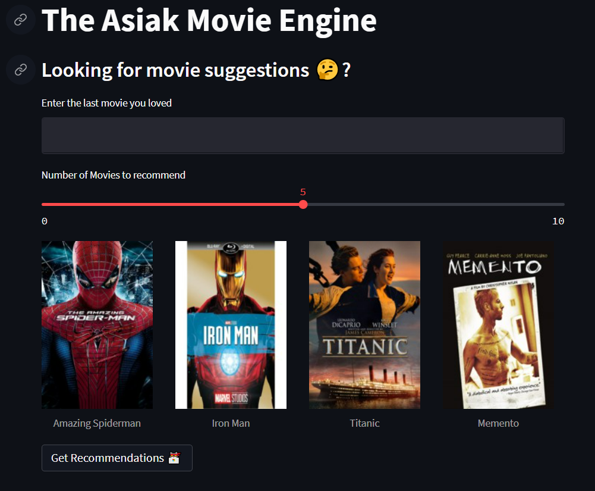

# asiak-movengine
# asiak-movengine

## 🧐 About 

This repo contains the source code for the movie recommender system deployed on streamlit
- Try out a demo here

## 🏁 Getting Started 
These instructions will get you a copy of the project up and running on your local machine for development and testing purposes. See [deployment](#deployment) for notes on how to deploy the project on a live system.

- Open in your favourite IDE of choice for python.
- Your IDE should activate a virtual environment, if not run :
  - `pip install virtualenv ` to install virtualenv
  - `virtualenv venv` to create a virtual virtualenv folder which will contain packages
  - `source venv/bin/activate` for macOS and `venv\Scripts\activate.bat` for Windows
- run `pip install -r requirements.txt ` in the application root directory

### Prerequisites

What things you need to run/debug the application and how to install them.

- Python >= 3.7

## Deploying on Streamlit locally
- Run `streamlit run main_page.py ` to deploy to your local server

